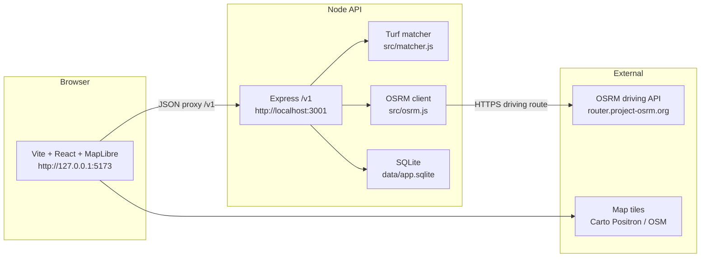
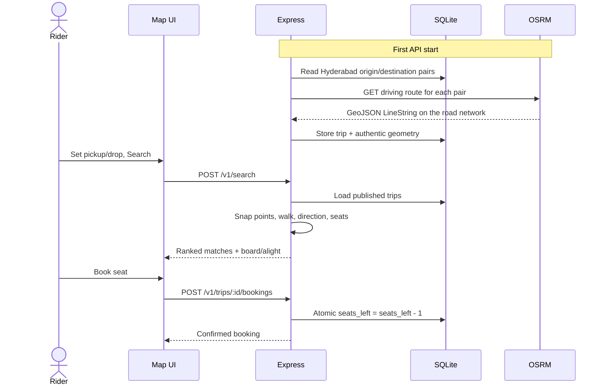

# v1 build notes — Hyderabad carpool matcher

This page is the record of what we built, why, and how to run it. GitHub renders the
diagrams below automatically.

**Repo:** [https://github.com/7NvN/CoordinatesSearchingEnginePOC](https://github.com/7NvN/CoordinatesSearchingEnginePOC)

This is a **carpool matching demo**, not a taxi product and not live GPS tracking.

---

## 1. Goal

Turn the original CLI proof of concept (`search_engine.js` + `routes_db.json`) into a
local web demo:

1. Rider drops pickup and drop pins on a map.
2. The API ranks driver trips that pass nearby, in the correct direction, with a free seat.
3. Rider can book a seat; driver can publish a new trip.
4. **Every stored path is a real road route from OSRM**, not a hand-drawn dummy LineString.

---

## 2. Architecture





**Coordinate rule:** internally GeoJSON `[lng, lat]`. The API also accepts `{ lat, lng }`
and converts once at the edge.

---

## 3. What we started from

The original POC had:

| File | Role |
| --- | --- |
| `search_engine.js` | Hardcoded Hyderabad pickup/drop, scan all JSON routes with Turf |
| `get_route.js` | One-off OSRM fetch (Divyasree Orion → Kondapur) |
| `routes_db.json` | Dummy driver LineStrings (mixed cities) |
| `cordinates.csv` | Extra coordinates, not used by the matcher |

Matching logic (kept):

1. Snap pickup and drop to the nearest points on the driver line.
2. Reject if either walk is over the threshold (default 500 m, cap 2000 m).
3. Reject if pickup is not *before* drop along the line (wrong direction).
4. Reject if `availableSeats` is 0.
5. Rank remaining trips by smallest total walk.

That logic now lives in `src/matcher.js` and is covered by `tests/matcher.test.js`.

---

## 4. What we built (step by step)

### Step 1 — Extract the matcher

- Moved ranking into `src/matcher.js` so CLI and HTTP share one function.
- Added bbox prefilter and optional departure window before the expensive Turf work.
- Response now includes `board` and `alight` (snap points) for the map.
- Unit tests: match, too far, opposite direction, no seats, ranking, time window, debug skip reasons.

### Step 2 — SQLite + seed users

Schema (simplified):

- `users` — seeded `u_rider` (Neha) and `u_driver` (Arjun). No login in v1.
- `vehicles` — demo hatchback.
- `trips` — origin, destination, departure, seats, status.
- `trip_geometry` — OSRM GeoJSON LineString, distance, duration.
- `bookings` — rider, pickup/drop, walk metres, status.

Seat booking is a single SQL update:

```sql
UPDATE trips
SET seats_left = seats_left - 1,
    status = CASE WHEN seats_left - 1 <= 0 THEN 'full' ELSE status END
WHERE id = ? AND seats_left > 0 AND status = 'published'
```

Zero rows updated means the trip is full (`409`).

### Step 3 — Authentic routes only

`routes_db.json` is **not** copied into SQLite.

On first API start we:

1. Keep only Hyderabad records (ROUTE_003, ROUTE_004, ROUTE_005) by checking the first coordinate.
2. Take each record’s **origin and destination** only.
3. Call the official OSRM **driving** API.
4. Store the returned road LineString.

If OSRM cannot build any path, seed fails. We do not fall back to dummy geometry.

Publish (`POST /v1/trips`) always calls OSRM again. The browser cannot upload a LineString.

Preview (`POST /v1/routes/preview`) is the same OSRM client, with a short in-memory cache
rounded to about 100 m so we do not hammer the public server.

Health (`GET /health`) pings OSRM with a real driving request, not a dummy payload.

### Step 4 — Express `/v1` API

| Method | Path | What it does |
| --- | --- | --- |
| `GET` | `/health` | API up + OSRM driving check |
| `GET` | `/v1/users` | Seeded demo users |
| `POST` | `/v1/search` | Rank published trips for pickup/drop |
| `POST` | `/v1/routes/preview` | OSRM LineString for two pins |
| `POST` | `/v1/trips` | Publish a trip (OSRM geometry required) |
| `GET` | `/v1/trips/:id` | Trip + geometry for the map |
| `POST` | `/v1/trips/:id/bookings` | Confirm a seat if the trip still matches |
| `GET` | `/v1/bookings` | List bookings (`?riderId=u_rider`) |
| `POST` | `/v1/bookings/:id/cancel` | Cancel and restore a seat |

Search and preview are rate-limited in memory.

Example search body:

```json
{
  "pickup": { "lng": 78.34588, "lat": 17.450918 },
  "drop": { "lng": 78.3691652, "lat": 17.4342597 },
  "maxWalkMeters": 500
}
```

### Step 5 — Map UI

`web/` is Vite + React + MapLibre.

- Search tab: two pins, walk slider, ranked list, draw OSRM polyline, book.
- Publish tab: origin/destination, datetime, seats, preview path, publish (driver role).
- Bookings tab: list and cancel.
- Header: Act as Rider (Neha) or Driver (Arjun).
- Map clicks alternate the two points. Green = pickup/origin, red = drop/destination,
  blue = board, purple = alight.

Vite proxies `/v1` and `/health` to `http://localhost:3001`.

### Step 6 — Run on this machine

Node was not on PATH. We used the **official** Node.js 22 Windows zip from
[nodejs.org/dist](https://nodejs.org/dist/) (SHA-256 checked). That copy stays in
`tools/` and is gitignored.

Corporate HTTPS inspection caused `SELF_SIGNED_CERT_IN_CHAIN` until we started Node
with `--use-system-ca` (already in `npm run dev`). TLS is not disabled.

Verified locally:

- Matcher tests: 7 passed.
- `POST /v1/search` at 500 m: `ROUTE_005` (OSRM line, ~40 m total walk).
- At 1000 m: `ROUTE_005` and `ROUTE_004`.
- Preview: hundreds of road points, real km/minutes.
- Book then cancel: seats 2 → 1 → 2.

---

## 5. Line-by-line: run it yourself

Use Node 18+ (22 is what we used). From the repo root:

1. `git clone https://github.com/7NvN/CoordinatesSearchingEnginePOC.git`
2. `cd CoordinatesSearchingEnginePOC`
3. `npm install`
4. `npm install --prefix web`
5. `npm test`
6. `npm run dev`  
   First start rebuilds three Hyderabad trips via OSRM and writes `data/app.sqlite`.
7. In a **second** terminal: `npm run web`
8. Open [http://127.0.0.1:5173/](http://127.0.0.1:5173/)
9. Click **Search rides** (defaults are near Divyasree Orion → Gachibowli).
10. Select a result to see the OSRM path and board/alight markers.
11. Click **Book seat**. Check **Bookings**, then **Cancel** to restore the seat.
12. Switch **Act as** to Driver.
13. Open **Publish**, click the map for origin then destination.
14. Click **Preview path** (OSRM), then **Publish trip**.
15. Switch back to Rider, search again; the new trip can match if you are close to that road.

Optional config: copy `.env.example` to `.env` and set `PORT`, `OSRM_BASE_URL`,
`DB_PATH`, or `CORS_ORIGIN`.

To reset seed data, stop the API and delete `data/app.sqlite` (and `-wal`/`-shm` if present),
then start `npm run dev` again so OSRM is called from scratch.

---

## 6. Repository layout

```
.env.example          PORT, OSRM URL, DB path, CORS
.gitignore            node_modules, sqlite, tools/, .env
IMPLEMENTATION_PLAN.md  original product plan
V1.md                 this file
README.md             short runbook
src/coords.js         parse {lat,lng} or [lng,lat], bbox, walk cap
src/matcher.js        ranking
src/osrm.js           official driving API + cache + health ping
src/db.js             schema, OSRM seed, atomic seats
src/server.js         Express app
web/                  Vite UI
tests/matcher.test.js
search_engine.js      old CLI, now calls src/matcher.js
get_route.js          old CLI, now calls src/osrm.js
routes_db.json        origin/destination catalogue only (geometry not stored)
```

---

## 7. Decisions we froze for v1

| Topic | Choice |
| --- | --- |
| Language | JavaScript (same as the POC) |
| API | Express, REST `/v1` |
| Database | SQLite |
| Maps | MapLibre + Carto/OSM tiles |
| Routing | Public OSRM driving API only |
| Auth | Seeded users, no login |
| City | Hyderabad only |
| Booking | Immediate confirm, atomic seat decrement |
| Dummy JSON geometry | Never persisted |

Out of v1 (later): login, PostGIS, payments, native app, pedestrian walk routing,
hosted production URL.

---

## 8. Related docs

- [README.md](./README.md) — short start commands
- [IMPLEMENTATION_PLAN.md](./IMPLEMENTATION_PLAN.md) — earlier product sketch
